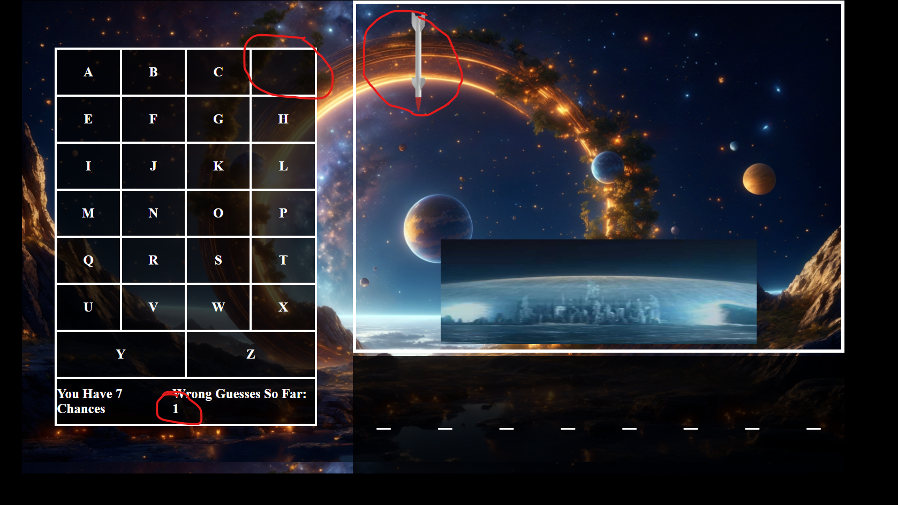

<h1>An Nguyen SEI-Project 1-SpaceMan</h1>
<h2>Game Description - SpaceMan</h2>

This is a game of Spaceman which is a spin on the original Hangman. For this game, the player gets an unknown word. The goal for the player is to guess all the correct letters in the word. They can choose what letter to select on the left side of the screen. They are allowed to make six mistakes on the seventh mistake the game is over. Every wrong letter that the player makes causes another missle to fall on the city and the city will blow up on the seventh mistake. If the player guesses all the letters right the city is safe and the words you win appear. If the player loses the city is on fire and the player sees the words you lose. After a few seconds of winning or losing the player is prompted if they would like to play again or not. 

<h2>Game Pictures</h2>

This is the first thing that comes up when you open the game. On the bottom left of the screen you see how many chances you have and how many mistakes you have made. On the bottom right side you see how many spaces there are, representing how many letters the word has. You then start guessing which letters the word contains. 
 

Here you can see I clicked the letter D. After I clicked it, the letter disappears and I can no longer click it again. The word did not contain the letter D so the wrong guess counter went up and a missle was dropped on the city.

Here I clicked the letter C which in the word and the filles in one of the spaces, no missle is dropped and the counter does not go up.

Here is an example of when the player loses. The city explodes, the correct word is displayed, and the text Game Over appears where the counter was.

Here is an example of the palyer winning, the city does not explode, in this case no wrong guesses were made. And the message You Win is displayed.

After a few second whether winning or losing, the player is then prompted with a buttong if they would like to play again.

